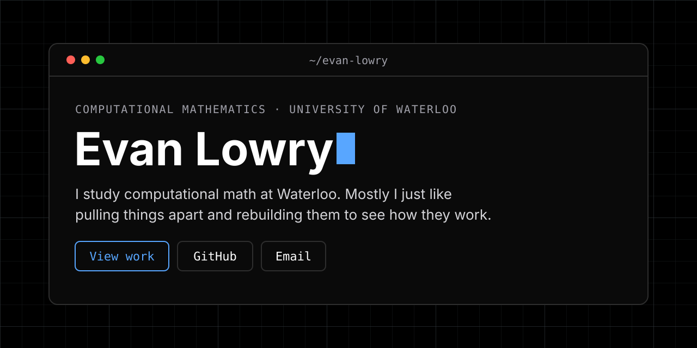

  

# Hi, I'm Evan Lowry

Honours Mathematics student at the University of Waterloo. I build systems that have to actually run: APIs that hold up, products people use, and graphics I can explain from the math up.

**Site:** [evan-lowry.github.io](https://evan-lowry.github.io)

## What I'm working on

- Research with [Prof. Jimmy Lin](https://cs.uwaterloo.ca/~jimmylin/) / [Castorini](https://github.com/castorini): RankLLM, Anserini, and Pyserini through Fall 2026
- Attendance infrastructure for [Don't Mess with the Don](https://github.com/uwblueprint/dont-mess-with-the-don) at UW Blueprint
- Rebuilding a local restaurant's ordering stack in Next.js, React, and TypeScript
- [Qube](https://github.com/Evan-Lowry/Qube), a GAN Bluetooth speedcube timer for iPhone, Mac, and Apple Watch

## Open source

- **Castorini (Prof. Jimmy Lin)** — onboarding and reproducibility on IR toolkits
  - [RankLLM CLI onboarding](https://github.com/castorini/rank_llm/pull/429)
  - [Anserini reproduction log](https://github.com/castorini/anserini/pull/3387)
  - [Pyserini reproduction log](https://github.com/castorini/pyserini/pull/2647)
- **UW Blueprint — Don't Mess with the Don** — FastAPI attendance API, tests, timezone-aware cron, QR check-in prototype
  - [Attendance API](https://github.com/uwblueprint/dont-mess-with-the-don/pull/20)
  - [Cron scheduler](https://github.com/uwblueprint/dont-mess-with-the-don/pull/35)
  - [QR check-in](https://github.com/uwblueprint/dont-mess-with-the-don/pull/32)

## Projects

- [**Qube**](https://github.com/Evan-Lowry/Qube) — SwiftUI timer with GAN Bluetooth, scramble, stats, CFOP practice, and a Watch companion
- [**Cube Solver**](https://github.com/Evan-Lowry/CubeSolver-Java) — Kociemba search with compact state tables and multithreaded search (~10× faster)
- [**3D Engine**](https://github.com/Evan-Lowry/3D-Engine) — software-only Java rasterizer: perspective-correct UVs, OBJ import, AABB collision
- Freelance ordering platform — Next.js cart and pizza builder; earlier Square storefront did $30k+ in online orders (private client)

### Hackathons

- **Derive AI** (CxC) — pen-first math notebook with handwriting recognition, step solving, and graphing
- [**Olympiknights**](https://github.com/diceccoj/deltahacks-12) (DeltaHacks 12) — Godot combat game driven by MediaPipe webcam poses
- [**ConflictZero**](https://github.com/Evan-Lowry/conflictzero) (Midnight) — prove a conflict check passed without exposing the relationships behind it

## Stack

**Languages:** Java, Python, TypeScript, Swift, C, C++  
**Web / backend:** Next.js, React, FastAPI, SQLAlchemy, Express  
**Other:** Git, SwiftUI, Godot, MediaPipe, data structures, algorithms, 3D graphics

## Connect

- [Website](https://evan-lowry.github.io)
- [LinkedIn](https://www.linkedin.com/in/ealowry/)
- [Email](mailto:elowry@uwaterloo.ca)
